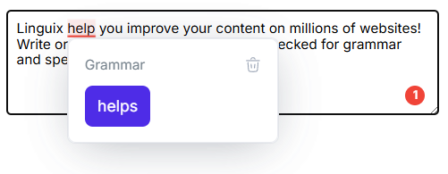

# Linguix Checker SDK Documentation

[](https://www.npmjs.com/package/@linguix.com/lx-checker-sdk)
[](https://www.jsdelivr.com/package/npm/@linguix.com/lx-checker-sdk)

[](https://god.gw.postman.com/run-collection/43914404-a2eee3b5-6e1f-4c3d-9f74-a9e218290e3c?action=collection%2Ffork&source=rip_markdown&collection-url=entityId%3D43914404-a2eee3b5-6e1f-4c3d-9f74-a9e218290e3c%26entityType%3Dcollection%26workspaceId%3D75c465e6-5a57-4c74-ae2f-1866d870acd5)

## Overview

Linguix Checker SDK provides grammar and spell checking functionality for web applications and browser extensions. The SDK can check text in textareas and contenteditable elements, highlighting errors and offering suggestions for correction.



## Features

- Grammar and spelling error detection
- Contextual correction suggestions
- Support for textarea and contenteditable elements
- HTML and JavaScript integration options
- Split architecture for browser extensions
- Customizable styling

## Documentation

- [Getting Started](getting-started.md) - Basic setup and usage guide
- [API Reference](api-reference.md) - Detailed method and interface reference
- [Styling Guide](styling.md) - Customization options for UI components
- [Next.js Integration](nextjs.md) - Guide for using the SDK with Next.js
- [Callbacks](callbacks.md) - Documentation for event callbacks
- [Changelog](CHANGELOG.md) - Version history and updates

## Quick Start

### Using with npm (Node.js/Modern Frontend)

```javascript
// Install
npm install @linguix.com/lx-checker-sdk

// Import
import { LinguixCheckerSDK } from '@linguix.com/lx-checker-sdk';

// Initialize
LinguixCheckerSDK.initialize({ apiKey: 'your-api-key' });

// Or with language forcing (when you know what language your users will use)
LinguixCheckerSDK.initialize({ 
  apiKey: 'your-api-key',
  language: 'en-US'
});

// Attach to elements
const textarea = document.querySelector('textarea');
LinguixCheckerSDK.attachToElement(textarea);

// Or wrap elements with <linguix-checkable> tags
<linguix-checkable>
  <textarea></textarea>
</linguix-checkable>
```

### Using Without npm (CDN/Script Tag, Server Templates)

You can use the Linguix Checker SDK in any environment that renders HTML, including PHP (Laravel Blade), Python (Jinja), or static HTML, by loading the SDK from a CDN and initializing it in a script tag.

> **Best Practice:** Place the `<script src="..."></script>` and the initialization code at the **end of your HTML body** (just before `</body>`). This ensures the DOM is loaded and improves page load performance.

```html
<!-- Place these just before </body> -->
<script src="https://cdn.jsdelivr.net/npm/@linguix.com/lx-checker-sdk/dist/bundle.min.js"></script>
<script>
  window.Linguix.LinguixCheckerSDK.initialize({ apiKey: 'your-api-key' });
  window.Linguix.LinguixCheckerSDK.attachToElement(document.querySelector('textarea'));
</script>
```

This will expose the SDK as `window.Linguix` for use in your scripts.

For more advanced usage, integration with frameworks, and additional examples, see [Getting Started](getting-started.md).

## Advanced Usage

The SDK supports a split architecture where UI and networking components run in separate contexts, ideal for browser extensions:

```javascript
// Background script
import { LinguixCheckerSDK } from '@linguix.com/lx-checker-sdk';
import { YourBackgroundMessenger } from './messenger';

const messenger = new YourBackgroundMessenger();
LinguixCheckerSDK.initialize({ apiKey: 'your-api-key' }, messenger);

// Content script
import { LinguixCheckerSDK } from '@linguix.com/lx-checker-sdk';
import { YourContentMessenger } from './messenger';

const messenger = new YourContentMessenger();
LinguixCheckerSDK.initialize({ apiKey: 'your-api-key' }, messenger);

// Attach to elements as usual
const textarea = document.querySelector('textarea');
LinguixCheckerSDK.attachToElement(textarea);
