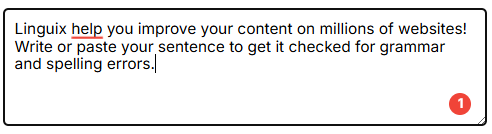

# Linguix Checker SDK API Reference

This document provides a reference for the public API of the Linguix Checker SDK.

## Table of Contents

- [LinguixCheckerSDK](#linguixcheckersdk)
  - [Methods](#methods)
- [Custom Elements](#custom-elements)
  - [linguix-checkable](#linguix-checkable)
- [Interfaces](#interfaces)
  - [ILinguixConfig](#ilinguixconfig)
  - [ILinguixCallbacks](#ilinguixcallbacks)
  - [ILinguixElementConfig](#ilinguixelementconfig)
  - [ILinguixTextStats](#ilinguixtextstats)
  - [ILinguixMessage](#ilinguixmessage)
  - [ILinguixContentMessenger](#ilinguixcontentmessenger)
  - [ILinguixBackgroundMessenger](#ilinguixbackgroundmessenger)
- [Callback Events](#callback-events)
  - [onCheckResultReceived](#oncheckresultreceived)
  - [onReplacementApplied](#onreplacementapplied)
- [UI Components](#ui-components)
  - [Status Bar](#status-bar)
- [Transport Layer](#transport-layer)
- [Service Worker Support](#service-worker-support)
- [Proxy Server](#proxy-server)

## LinguixCheckerSDK

### Methods

#### `initialize(config: ILinguixConfig, messenger?: ILinguixMessenger): void`

Initializes the SDK with the provided configuration and optional messenger.

**Parameters:**
- `config` (ILinguixConfig): Configuration object with the following properties:
  - `apiKey` (optional string): Your Linguix API key, can be omitted if custom proxy server is used
  - `url` (optional string): URL of your proxy server
  - `options` (optional object):
    - `query` (optional object): Query parameters to include in requests
      - `clientToken` (optional string): Token for authentication with your proxy server
  - `language` (optional string): Force the checker to use a specific language instead of automatic detection. By default, Linguix supports 30+ most popular languages with automatic detection. Manual language forcing is limited to: 'en-US', 'en-GB', 'en-ZA', 'en-CA', 'en-AU', 'en-NZ', 'pt-PT', 'pt-BR', 'de-DE', 'fr', 'pl-PL', 'es', 'it'
  - `callbacks` (optional object): Event callbacks for SDK operations
    - `onCheckResultReceived` (optional function): Called when check results are received
    - `onReplacementApplied` (optional function): Called when a user applies a replacement
  - `features` (optional object): Feature flags
    - `bar` (optional boolean): Enable or disable the status bar element
- `messenger` (optional): Custom messenger implementation
  - Pass `ILinguixBackgroundMessenger` to initialize background component
  - Pass `ILinguixContentMessenger` to initialize content component
  - If not provided, initializes both components in the same context

#### `attachToElement(element: SupportedElement, options?: ILinguixElementConfig): void`

Attaches the checker to a textarea or contenteditable element.

**Parameters:**
- `element`: HTMLTextAreaElement or HTMLElement with contenteditable attribute
- `options` (optional): Element-specific configuration
  - `callbacks` (optional object): Element-specific event callbacks
    - `onCheckResultReceived` (optional function): Called when check results are received for this element
    - `onReplacementApplied` (optional function): Called when a user applies a replacement in this element

#### `detachFromElement(element: SupportedElement): void`

Detaches the checker from an element.

**Parameters:**
- `element`: The element to detach from

#### `destroy(): void`

Destroys the SDK instance and cleans up all resources.

## Custom Elements

### `<linguix-checkable>`

A wrapper element that automatically initializes the grammar checker for contained textarea or contenteditable elements.

**Usage:**
```html
<linguix-checkable>
  <textarea></textarea>
</linguix-checkable>
```

## Interfaces

### ILinguixConfig

```typescript
interface ILinguixConfig {
    url?: string;
    apiKey?: string;
    options?: {
        query?: {
            clientToken?: string;
        };
    };
    language?: string;
    callbacks?: ILinguixCallbacks;
    features?: {
        bar?: boolean;
    };
}
```

### ILinguixCallbacks

```typescript
interface ILinguixCallbacks {
    onCheckResultReceived?: (result: { 
        textStats?: ILinguixTextStats, 
        alertsCount: number 
    }) => void;
    onReplacementApplied?: (data: { 
        originalText: string,
        replacement: string,
        description: string
    }) => void;
}
```

### ILinguixElementConfig

```typescript
interface ILinguixElementConfig {
    callbacks?: ILinguixCallbacks;
}
```

### ILinguixTextStats

```typescript
interface ILinguixTextStats {
    wordsCount: number;        // Total number of words in the text
    charsCount: number;        // Total number of characters in the text
    avgWordLength: number;     // Average word length
    avgSentenceLength: number; // Average sentence length (in words)
    sentencesCount: number;    // Total number of sentences
    fleschIndex: number;       // Flesch Reading Ease score (0-100, higher is easier to read)
    textScore: number;         // Overall text quality score
    readingTimeSeconds: number; // Estimated reading time in seconds
    speakingTimeSeconds: number; // Estimated speaking time in seconds
}
```

### ILinguixMessage

```typescript
interface ILinguixMessage {
    type: string;    // Message type
    id: string;      // Unique input field identifier
    payload?: any;   // Optional message data
}
```

### ILinguixContentMessenger

Interface for implementing content-side messaging.

```typescript
interface ILinguixContentMessenger {
    sendToBackground(message: ILinguixMessage): void;
    onBackgroundMessage(callback: (message: ILinguixMessage) => void): void;
    destroy(): void;
}
```

### ILinguixBackgroundMessenger

Interface for implementing background-side messaging.

```typescript
interface ILinguixBackgroundMessenger {
    sendToContent(message: ILinguixMessage): void;
    onContentMessage(callback: (message: ILinguixMessage) => void): void;
    destroy(): void;
}
```

## Callback Events

### onCheckResultReceived

Triggered when check results are received from the Linguix API.

**Callback data:**
- `textStats`: Statistics about the checked text (readability scores, word count, etc.)
- `alertsCount`: The number of alerts (grammar/spelling issues) found in the text

### onReplacementApplied

Triggered when a user applies a replacement suggestion from the popover.

**Callback data:**
- `originalText`: The original text that was replaced
- `replacement`: The replacement text that was applied
- `description`: The description of the error as shown in the alert popover

## UI Components

The SDK provides several UI components that are automatically attached to the input fields:

### Status Bar

A status indicator that appears in the bottom-right corner of the input field, showing the current state of the grammar checking process.



The status bar displays:
- A loading spinner when text is being checked (purple when initial, red for errors, green for no errors)
- A count of grammar/spelling issues found (red badge with number)
- A checkmark when no issues are found (green badge with checkmark)

**Styling Options**: The status bar appearance can be fully customized using CSS variables. See the [Status Bar Styling](styling.md#status-bar-styling) section in the styling guide for complete customization options.

**Configuration:**

You can disable the status bar entirely:
```javascript
LinguixCheckerSDK.initialize({
  apiKey: 'your-api-key',
  features: {
    bar: false // Disables the status bar
  }
});
```

## See Also

For more detailed information on using callbacks, see the [Callbacks Documentation](callbacks.md).

## Transport Layer

The SDK uses WebSockets for communication with Linguix grammar checking services. If you need HTTP transport instead, please contact us at hi@linguix.com.

## Service Worker Support

For background scripts running in service worker environments (like browser extensions' background scripts) where browser DOM APIs are not available, the SDK provides a specialized worker import:

```javascript
import { LinguixCheckerSDK } from '@linguix.com/lx-checker-sdk/worker';
```

This is a drop-in replacement for the standard import that provides the same API but is optimized for environments without browser DOM APIs. When using this import:

1. The messenger parameter is required when initializing the SDK
2. The messenger must implement the `ILinguixBackgroundMessenger` interface
3. Only background component functionality is available (no UI components)

Example usage:

```javascript
import { LinguixCheckerSDK } from '@linguix.com/lx-checker-sdk/worker';

// A messenger implementation is required in worker environments
const messenger = new YourBackgroundMessenger();

// Initialize with API key
LinguixCheckerSDK.initialize({apiKey: 'your-api-key'}, messenger);

// Or with custom configuration
LinguixCheckerSDK.initialize({
  url: 'http://your-proxy-server.com:3000',
  options: {
    query: {
      clientToken: 'some-token'
    }
  }
}, messenger);
```

## Proxy Server

For production applications, you may want to use a proxy server to keep your API key secure. See the [Proxy Server Guide](proxy-server.md) for implementation details.

When using a proxy server, initialize the SDK with the `initialize` method:

```javascript
LinguixCheckerSDK.initialize({
  url: 'http://localhost:3000',
  options: {
    query: {
      clientToken: 'some-token'
    }
  }
});
```