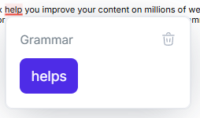
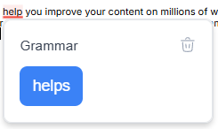
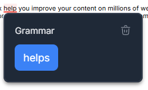
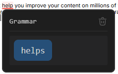
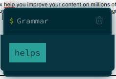
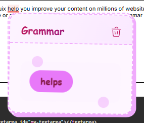
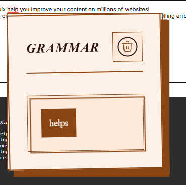
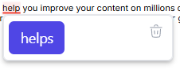
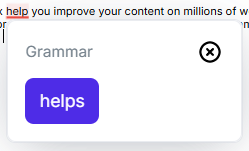

# Linguix SDK Styling Guide

This guide explains how to customize the appearance of Linguix SDK components using CSS Custom Properties (CSS variables) and Shadow Parts.

## Subscription Requirements

> **Important**: All styling customization options described in this document are available **only** for users with a paid API subscription plan. Free users will see the default Linguix styling which includes a "Powered by Linguix" attribution in the alert popover. These default styles cannot be modified without an active subscription.

### Default Appearance
Free users will see:
- Default color scheme and typography
- Standard layout and positioning
- "Powered by Linguix" attribution in the alert popover
- Default highlight colors and underlines

### Customization Access
- **Paid API Plans**: Full access to all styling options described below
- **Free Plans**: No customization options available, default styles only

## Table of Contents

- [Alert Popover Styling](#alert-popover-styling)
  - [Basic Usage](#basic-usage)
  - [CSS Custom Properties](#css-custom-properties)
  - [Shadow Parts](#shadow-parts)
  - [Examples](#examples)
    - [Modern Light Theme](#modern-light-theme)
    - [Dark Theme](#dark-theme)
    - [Minimal Code Editor Style](#minimal-code-editor-style)
    - [Terminal Theme](#terminal-theme)
    - [Playful Bubbly Style](#playful-bubbly-style)
    - [Radical Transformation](#radical-transformation)
    - [Minimalist Float Style](#minimalist-float-style)
    - [Custom Dismiss Button Style](#custom-dismiss-button-style)
- [Highlighter Styling](#highlighter-styling)
  - [CSS Variables](#highlighter-css-variables)
  - [Usage Examples](#usage-examples)
    - [Basic Styling](#basic-styling)
    - [Semantic Styles](#semantic-styles)
    - [Subtle Style](#subtle-style)
  - [Z-Index Management](#z-index-management)
  - [Best Practices](#best-practices)
- [Status Bar Styling](#status-bar-styling)
  - [Available CSS Variables](#status-bar-css-variables)
  - [Usage Examples](#status-bar-examples)
    - [Basic Styling](#status-bar-basic-styling)
    - [Custom Colors](#status-bar-custom-colors)
    - [Minimal Style](#status-bar-minimal-style)
    - [Custom Sizes](#status-bar-custom-sizes)
    - [Compact Style](#status-bar-compact-style)

## Alert Popover Styling

The Linguix Alert Popover component (`linguix-alert`) can be customized using CSS Custom Properties and Shadow Parts. This section covers all available customization options.



### Basic Usage

To customize the Alert Popover, you can define CSS Custom Properties in your stylesheet:

```css
linguix-alert {
    --lx-background-color: #f8f9fa;
    --lx-border-color: #dee2e6;
    --lx-replacement-background: #28a745;
}
```

## CSS Custom Properties

### Typography

| Property | Default | Description |
|----------|---------|-------------|
| `--lx-font-family` | `Inter, sans-serif` | Main font family for the component |
| `--lx-font-size` | `16px` | Base font size |
| `--lx-font-weight` | `400` | Base font weight |
| `--lx-line-height` | `120%` | Base line height |
| `--lx-text-color` | `#77838D` | Base text color |

### Colors and Background

| Property | Default | Description |
|----------|---------|-------------|
| `--lx-background-color` | `white` | Background color of the popover |
| `--lx-border-color` | `#EAECF0` | Border color of the popover |

### Borders and Shadows

| Property | Default | Description |
|----------|---------|-------------|
| `--lx-border-radius` | `8px` | Border radius for the popover |
| `--lx-border-width` | `1px` | Border width |
| `--lx-border-style` | `solid` | Border style |
| `--lx-box-shadow` | `0px 8px 48px -12px rgba(68, 75, 90, 0.24)` | Box shadow |

### Spacing

| Property | Default | Description |
|----------|---------|-------------|
| `--lx-card-padding` | `16px` | Internal padding of the card |
| `--lx-content-gap` | `12px` | Gap between elements |

### Title Customization

| Property | Default | Description |
|----------|---------|-------------|
| `--lx-title-color` | `#667085` | Title text color |
| `--lx-title-font-size` | `14px` | Title font size |
| `--lx-title-font-weight` | `400` | Title font weight |

### Replacement Button

| Property | Default | Description |
|----------|---------|-------------|
| `--lx-replacement-background` | `#4E2CE7` | Button background color |
| `--lx-replacement-hover-background` | `#311A96` | Button background color on hover |
| `--lx-replacement-color` | `white` | Button text color |
| `--lx-replacement-hover-color` | `white` | Button text color on hover |
| `--lx-replacement-padding` | `11px 13px` | Button padding |
| `--lx-replacement-font-size` | `var(--lx-font-size)` | Button font size |
| `--lx-replacement-font-weight` | `400` | Button font weight |
| `--lx-replacement-border-radius` | `var(--lx-border-radius)` | Button border radius |
| `--lx-replacement-border-width` | `0` | Button border width |
| `--lx-replacement-border-style` | `none` | Button border style |
| `--lx-replacement-border-color` | `transparent` | Button border color |
| `--lx-replacement-hover-border-color` | `transparent` | Button border color on hover |

### Dismiss Button

| Property | Default | Description |
|----------|---------|-------------|
| `--lx-dismiss-button-size` | `18px` | Size of the dismiss button |
| `--lx-dismiss-button-color` | `#98A2B3` | Color of the dismiss icon |
| `--lx-dismiss-button-hover-color` | `#E84337` | Color of the dismiss icon on hover |
| `--lx-dismiss-button-z-index` | `1` | Z-index of the dismiss button |

## Shadow Parts

Shadow Parts allow you to style specific structural elements of the component:

| Part | Description |
|------|-------------|
| `card` | The main container |
| `header` | The header section containing title and buttons |
| `title` | The title element |
| `buttons` | The buttons container |
| `dismiss-button` | The dismiss button |
| `dismiss-icon` | The dismiss button icon |
| `replacements` | The replacements container |

Example usage:
```css
linguix-alert::part(header) {
    border-bottom: 1px solid var(--lx-border-color);
    padding-bottom: 8px;
}
```

## Examples

### Modern Light Theme



```css
linguix-alert {
    --lx-font-family: 'Roboto', sans-serif;
    --lx-background-color: #ffffff;
    --lx-border-color: #e5e7eb;
    --lx-box-shadow: 0 4px 6px -1px rgb(0 0 0 / 0.1);
    --lx-text-color: #374151;
    --lx-title-color: #111827;
    --lx-title-font-weight: 500;
    --lx-replacement-background: #3b82f6;
    --lx-replacement-hover-background: #2563eb;
}
```

### Dark Theme



```css
linguix-alert {
    --lx-background-color: #1f2937;
    --lx-border-color: #374151;
    --lx-text-color: #e5e7eb;
    --lx-title-color: #f3f4f6;
    --lx-box-shadow: 0 4px 6px -1px rgb(0 0 0 / 0.3);
    --lx-replacement-background: #3b82f6;
    --lx-replacement-hover-background: #2563eb;
    --lx-dismiss-button-color: #9ca3af;
    --lx-dismiss-button-hover-color: #f87171;
}
```

### Minimal Code Editor Style



```css
linguix-alert {
    --lx-background-color: #1e1e1e;
    --lx-border-color: #333333;
    --lx-box-shadow: none;
    --lx-text-color: #d4d4d4;
    --lx-title-color: #9cdcfe;
    --lx-font-family: 'JetBrains Mono', 'Fira Code', monospace;
    --lx-font-size: 14px;
    --lx-title-font-size: 13px;
    --lx-card-padding: 12px;
    --lx-content-gap: 8px;
    --lx-replacement-background: #264f78;
    --lx-replacement-hover-background: #37699d;
    --lx-replacement-color: #d4d4d4;
    --lx-dismiss-button-color: #808080;
    --lx-dismiss-button-hover-color: #c586c0;
}

linguix-alert::part(header) {
    border-bottom: 1px solid #333333;
    padding-bottom: 8px;
}

linguix-alert::part(title) {
    font-family: inherit;
    opacity: 0.9;
}

linguix-alert::part(replacements) {
    font-family: inherit;
    background: #252526;
    padding: 8px;
    border-radius: 3px;
}

linguix-alert::part(dismiss-button) {
    opacity: 0.8;
    transition: opacity 0.2s;
}

linguix-alert::part(dismiss-button):hover {
    opacity: 1;
}
```

### Terminal Theme



```css
linguix-alert {
    /* Base styles */
    --lx-background-color: #002b36;
    --lx-border-color: #073642;
    --lx-box-shadow: 0 0 0 1px #073642, 0 0 20px rgba(0, 43, 54, 0.5);
    --lx-border-radius: 6px;
    --lx-text-color: #839496;

    /* Typography */
    --lx-font-family: 'Source Code Pro', 'Fira Mono', monospace;
    --lx-font-size: 14px;
    --lx-line-height: 1.5;
    --lx-title-color: #93a1a1;
    --lx-title-font-size: 14px;
    --lx-title-font-weight: normal;

    /* Spacing */
    --lx-card-padding: 8px;
    --lx-content-gap: 6px;

    /* Replacement button */
    --lx-replacement-background: #2aa198;
    --lx-replacement-hover-background: #268bd2;
    --lx-replacement-color: #002b36;
    --lx-replacement-hover-color: #002b36;
    --lx-replacement-font-family: inherit;
    --lx-replacement-font-size: inherit;
    --lx-replacement-border-radius: 0;
    --lx-replacement-padding: 6px 10px;

    /* Dismiss button */
    --lx-dismiss-button-color: #586e75;
    --lx-dismiss-button-hover-color: #dc322f;
}

/* Terminal-like header with prompt */
linguix-alert::part(header) {
    display: flex;
    align-items: center;
    padding-bottom: 6px;
    border-bottom: 1px solid #073642;
}

linguix-alert::part(title) {
    display: flex;
    align-items: center;
}

linguix-alert::part(title)::before {
    content: '$ ';
    color: #859900;
    margin-right: 6px;
}

/* Command-like styling for dismiss button */
linguix-alert::part(dismiss-button) {
    position: relative;
    padding: 4px;
    opacity: 0.7;
    transition: opacity 0.2s ease;
}

linguix-alert::part(dismiss-button):hover {
    opacity: 1;
}

/* Code block styling for replacements */
linguix-alert::part(replacements) {
    background: #073642;
    margin: 0 -16px 0px;
    padding: 16px;
    border-bottom-left-radius: inherit;
    border-bottom-right-radius: inherit;
    position: relative;
}
```

### Playful Bubbly Style



```css
linguix-alert {
    --lx-background-color: #fef6ff;
    --lx-border-color: #f0abfc;
    --lx-border-width: 2px;
    --lx-border-style: dashed;
    --lx-box-shadow: 4px 4px 0 #f0abfc;
    --lx-border-radius: 16px;
    --lx-text-color: #86198f;
    --lx-title-color: #be185d;
    --lx-font-family: 'Comic Sans MS', 'Chalkboard SE', sans-serif;
    --lx-font-size: 16px;
    --lx-title-font-size: 18px;
    --lx-title-font-weight: bold;
    --lx-card-padding: 20px;
    --lx-content-gap: 16px;
    --lx-replacement-background: #e879f9;
    --lx-replacement-hover-background: #d946ef;
    --lx-replacement-color: #831843;
    --lx-replacement-hover-color: #831843;
    --lx-replacement-border-radius: 24px;
    --lx-replacement-padding: 10px 20px;
    --lx-replacement-font-weight: bold;
    --lx-dismiss-button-color: #be185d;
    --lx-dismiss-button-hover-color: #9d174d;
}

linguix-alert::part(card) {
    transform: rotate(1deg);
}

linguix-alert::part(header) {
    background: linear-gradient(120deg, #fdf4ff 0%, #fae8ff 100%);
    margin: -20px -20px 16px;
    padding: 20px 20px 12px;
    border-top-left-radius: 14px;
    border-top-right-radius: 14px;
    border-bottom: 2px dashed #f0abfc;
}

linguix-alert::part(title) {
    background: linear-gradient(120deg, #be185d 0%, #86198f 100%);
    -webkit-background-clip: text;
    -webkit-text-fill-color: transparent;
    font-size: 18px;
}

linguix-alert::part(dismiss-button) {
    transform: scale(1.2);
    transition: transform 0.3s cubic-bezier(0.34, 1.56, 0.64, 1);
}

linguix-alert::part(dismiss-button):hover {
    transform: scale(1.4) rotate(180deg);
}

linguix-alert::part(replacements) {
    position: relative;
    background: #fdf4ff;
    padding: 16px;
    border-radius: 12px;
}

linguix-alert::part(replacements)::before,
linguix-alert::part(replacements)::after {
    content: '';
    position: absolute;
    width: 20px;
    height: 20px;
    border-radius: 50%;
    background: #f0abfc;
    opacity: 0.5;
}

linguix-alert::part(replacements)::before {
    top: -10px;
    left: 20px;
}

linguix-alert::part(replacements)::after {
    bottom: -10px;
    right: 20px;
}
```

### Radical Transformation



```css
/* This example showcases all available customization options */
linguix-alert {
    /* Typography */
    --lx-font-family: 'Playfair Display', serif;
    --lx-font-size: 18px;
    --lx-font-weight: 400;
    --lx-line-height: 1.6;
    --lx-text-color: #2c1810;

    /* Colors and Layout */
    --lx-background-color: #fdf1e7;
    --lx-border-color: #8b4513;
    --lx-border-radius: 0;
    --lx-border-width: 2px;
    --lx-border-style: double;
    --lx-box-shadow: 12px 12px 0 #8b4513;
    
    /* Spacing */
    --lx-card-padding: 32px;
    --lx-content-gap: 24px;
    
    /* Title */
    --lx-title-color: #5c1f0c;
    --lx-title-font-size: 24px;
    --lx-title-font-weight: 700;
    
    /* Replacement Button */
    --lx-replacement-background: #8b4513;
    --lx-replacement-hover-background: #5c1f0c;
    --lx-replacement-color: #fdf1e7;
    --lx-replacement-hover-color: #ffffff;
    --lx-replacement-font-family: inherit;
    --lx-replacement-font-size: inherit;
    --lx-replacement-border-radius: 0;
    --lx-replacement-border-width: 2px;
    --lx-replacement-border-style: solid;
    --lx-replacement-border-color: #8b4513;
    --lx-replacement-hover-border-color: #5c1f0c;
    
    /* Dismiss Button */
    --lx-dismiss-button-size: 24px;
    --lx-dismiss-button-color: #8b4513;
    --lx-dismiss-button-hover-color: #5c1f0c;
}

/* Shadow Parts Styling */
linguix-alert::part(card) {
    transform: rotate(-1deg);
    transition: transform 0.3s ease;
}

linguix-alert::part(card):hover {
    transform: rotate(0deg);
}

linguix-alert::part(header) {
    border-bottom: 2px solid #8b4513;
    padding-bottom: 16px;
    margin-bottom: 16px;
}

linguix-alert::part(title) {
    font-style: italic;
    letter-spacing: 0.05em;
    text-transform: uppercase;
}

linguix-alert::part(buttons) {
    background: #fbeadb;
    padding: 8px;
    border: 1px solid #8b4513;
}

linguix-alert::part(dismiss-button) {
    border: 2px solid currentColor;
    border-radius: 50%;
    padding: 4px;
    transition: all 0.3s ease;
}

linguix-alert::part(dismiss-button):hover {
    transform: rotate(90deg);
}

linguix-alert::part(replacements) {
    background: #fbeadb;
    padding: 24px;
    border: 1px solid #8b4513;
    position: relative;
}

linguix-alert::part(replacements)::before {
    content: '';
    position: absolute;
    top: 0;
    left: 0;
    right: 0;
    bottom: 0;
    border: 2px solid #8b4513;
    transform: translate(4px, 4px);
    pointer-events: none;
}
```

### Minimalist Float Style



```css
linguix-alert {
  --lx-background-color: #ffffff;
  --lx-border-color: #e5e7eb;
  --lx-box-shadow: 0 4px 6px -1px rgb(0 0 0 / 0.1), 0 2px 4px -2px rgb(0 0 0 / 0.1);
  --lx-border-radius: 6px;
  --lx-text-color: #374151;
  --lx-font-family: system-ui, -apple-system, sans-serif;
  --lx-font-size: 14px;
  --lx-card-padding: 6px;
  --lx-content-gap: 0px;

  /* Hide title */
  --lx-title-font-size: 0;
  --lx-title-color: transparent;

  /* Replacement button */
  --lx-replacement-background: #4f46e5;
  --lx-replacement-hover-background: #4338ca;
  --lx-replacement-color: white;
  --lx-replacement-hover-color: #ffffff;
  --lx-replacement-font-family: inherit;
  --lx-replacement-font-size: inherit;
  --lx-replacement-border-radius: 6px;

  /* Dismiss button */
  --lx-dismiss-button-color: #9ca3af;
  --lx-dismiss-button-hover-color: #6b7280;
}
  
linguix-alert::part(header) {
    height: 0;
}

/* Position buttons absolutely */
linguix-alert::part(buttons) {
    position: absolute;
    top: 6px;
    right: 6px;
    z-index: 10;
}

/* Add hover effect to buttons */
linguix-alert::part(dismiss-button) {
    padding: 4px;
    border-radius: 4px;
    transition: background-color 0.2s;
}

linguix-alert::part(dismiss-button):hover {
    background-color: #f3f4f6;
}
```

### Custom Dismiss Button Style



```css
linguix-alert {
    --lx-dismiss-button-size: 0;
}

/* Style the dismiss button with custom SVG */
linguix-alert::part(dismiss-button) {
    width: 24px;
    height: 24px;
    padding: 0;
    background-color: transparent;
    /* Circular close button with arrow */
    background-image: url("data:image/svg+xml,%3Csvg xmlns='http://www.w3.org/2000/svg' viewBox='0 0 24 24' fill='none' stroke='%23ffffff' stroke-width='2'%3E%3Ccircle cx='12' cy='12' r='9' stroke='currentColor' fill='none'/%3E%3Cpath d='M9 15L15 9M9 9l6 6' stroke='currentColor' stroke-linecap='round'/%3E%3C/svg%3E");
    background-size: contain;
    transition: transform 0.3s ease, filter 0.3s ease;
}

linguix-alert::part(dismiss-button) svg {
    display: none;
}

linguix-alert::part(dismiss-button):hover {
    transform: rotate(90deg);
    filter: brightness(0.8) contrast(1.2);
}

```

## Highlighter Styling

The Linguix Highlighter component (`linguix-highlighter`) can be customized using CSS Custom Properties (CSS variables). These variables allow you to control the appearance of text highlights, underlines, and positioning.

### Available CSS Variables

| Variable | Default | Description |
|----------|---------|-------------|
| `--lx-highlight-underline-color` | `#f04438` | Color of the underline beneath highlighted text |
| `--lx-highlight-underline-thickness` | `2px` | Thickness of the underline |
| `--lx-highlight-background-color` | `rgba(240, 68, 56, 0.1)` | Background color when text is selected |
| `--lx-highlight-background-opacity` | `1` | Opacity of the background highlight |
| `--lx-highlight-z-index` | `0` | Base z-index for the highlighter |

### Usage Examples

#### Basic Styling
```css
linguix-highlighter {
    --lx-highlight-underline-color: #dc2626;
    --lx-highlight-underline-thickness: 2px;
    --lx-highlight-background-color: rgba(220, 38, 38, 0.15);
    --lx-highlight-background-opacity: 1;
    --lx-highlight-z-index: 100;
}
```

#### Semantic Styles

##### Error Highlights
```css
linguix-highlighter {
    --lx-highlight-underline-color: #dc2626;
    --lx-highlight-underline-thickness: 2px;
    --lx-highlight-background-color: rgba(220, 38, 38, 0.15);
    --lx-highlight-background-opacity: 1;
}
```

##### Warning Highlights
```css
linguix-highlighter {
    --lx-highlight-underline-color: #eab308;
    --lx-highlight-underline-thickness: 2px;
    --lx-highlight-background-color: rgba(234, 179, 8, 0.1);
    --lx-highlight-background-opacity: 0.8;
}
```

##### Info Highlights
```css
linguix-highlighter {
    --lx-highlight-underline-color: #0ea5e9;
    --lx-highlight-underline-thickness: 1.5px;
    --lx-highlight-background-color: rgba(14, 165, 233, 0.08);
    --lx-highlight-background-opacity: 0.9;
}
```

#### Subtle Style
```css
linguix-highlighter {
    --lx-highlight-underline-color: #94a3b8;
    --lx-highlight-underline-thickness: 1px;
    --lx-highlight-background-color: rgba(148, 163, 184, 0.1);
    --lx-highlight-background-opacity: 0.5;
}
```

### Z-Index Management

The highlighter's z-index is computed by combining two values:
1. The base z-index set through `--lx-highlight-z-index`
2. The element's own z-index

The final z-index will be the sum of these two values. This allows for:
- Setting a base z-index for all highlights through CSS
- Maintaining proper stacking order relative to the highlighted element
- Fine-grained control over layering in complex UIs

Example of z-index customization:
```css
/* Set different z-index bases for different contexts */
.editor-content linguix-highlighter {
    --lx-highlight-z-index: 100;
}

.overlay-content linguix-highlighter {
    --lx-highlight-z-index: 1000;
}
```

### Best Practices

1. **Underline Visibility**
   - Keep `--lx-highlight-underline-thickness` between 1-3px for optimal visibility
   - Use contrasting colors for better readability

2. **Background Highlights**
   - Use semi-transparent colors for background highlights
   - Adjust opacity based on the contrast with text
   - Keep `--lx-highlight-background-opacity` below 0.2 for better readability

3. **Z-Index Management**
   - Start with lower z-index values and increment as needed
   - Consider the stacking context of your application
   - Use consistent z-index ranges for similar components

## Status Bar Styling

The Linguix Status Bar component shows the current state of grammar checking and error count. It can be customized using CSS Custom Properties (CSS variables) to match your application's design.

> **Important**: As with other styling customization options, status bar styling is available **only** for users with a paid API subscription plan. Free users will see the default Linguix styling which cannot be modified without an active subscription.


### Available CSS Variables

| Variable | Default | Description |
|----------|---------|-------------|
| `--lx-bar-spinner-background` | `#8155FD` | Background color of the spinner in its default state |
| `--lx-bar-spinner-error-background` | `#F04438` | Background color of the spinner when errors are found |
| `--lx-bar-spinner-success-background` | `#12B76A` | Background color of the spinner when no errors are found |
| `--lx-bar-count-error-background` | `#F04438` | Background color of the count badge when showing errors |
| `--lx-bar-count-success-background` | `#12B76A` | Background color of the count badge when showing success |
| `--lx-bar-text-color` | `#FFFFFF` | Text color for the count badge |
| `--lx-bar-z-index` | `2147483646` | Z-index for the status bar |
| `--lx-bar-border-radius` | `100px` | Border radius for the spinner and count badge |
| `--lx-bar-spinner-size` | `20px` | Width and height of the spinner element |
| `--lx-bar-count-size` | `20px` | Width and height of the count badge |
| `--lx-bar-font-size` | `12px` | Font size for the count text |
| `--lx-bar-font-weight` | `600` | Font weight for the count text |
| `--lx-bar-padding` | `6px` | Padding inside the wrapper element |
| `--lx-bar-gap` | `6px` | Gap between spinner and count badge |

### Usage Examples

#### Basic Styling

```css
linguix-bar {
    --lx-bar-spinner-background: #6366f1;
    --lx-bar-spinner-error-background: #ef4444;
    --lx-bar-spinner-success-background: #22c55e;
    --lx-bar-count-error-background: #ef4444;
    --lx-bar-count-success-background: #22c55e;
    --lx-bar-text-color: #ffffff;
}
```

#### Custom Colors

```css
/* Matching your brand colors */
linguix-bar {
    --lx-bar-spinner-background: #3b82f6;
    --lx-bar-spinner-error-background: #f97316;
    --lx-bar-spinner-success-background: #10b981;
    --lx-bar-count-error-background: #f97316;
    --lx-bar-count-success-background: #10b981;
    --lx-bar-border-radius: 8px;
}
```

#### Custom Sizes

```css
/* Larger elements */
linguix-bar {
    --lx-bar-spinner-size: 24px;
    --lx-bar-count-size: 24px;
    --lx-bar-font-size: 14px;
    --lx-bar-padding: 8px;
    --lx-bar-gap: 8px;
}
```

#### Compact Style

```css
/* Smaller, more compact elements */
linguix-bar {
    --lx-bar-spinner-size: 16px;
    --lx-bar-count-size: 16px;
    --lx-bar-font-size: 10px;
    --lx-bar-font-weight: 500;
    --lx-bar-padding: 4px;
    --lx-bar-gap: 4px;
    --lx-bar-border-radius: 4px;
}
```

#### Minimal Style

```css
/* Subtle, minimalist style */
linguix-bar {
    --lx-bar-spinner-background: rgba(0, 0, 0, 0.2);
    --lx-bar-spinner-error-background: rgba(239, 68, 68, 0.7);
    --lx-bar-spinner-success-background: rgba(34, 197, 94, 0.7);
    --lx-bar-count-error-background: rgba(239, 68, 68, 0.7);
    --lx-bar-count-success-background: rgba(34, 197, 94, 0.7);
    --lx-bar-text-color: rgba(255, 255, 255, 0.9);
    --lx-bar-border-radius: 4px;
}
